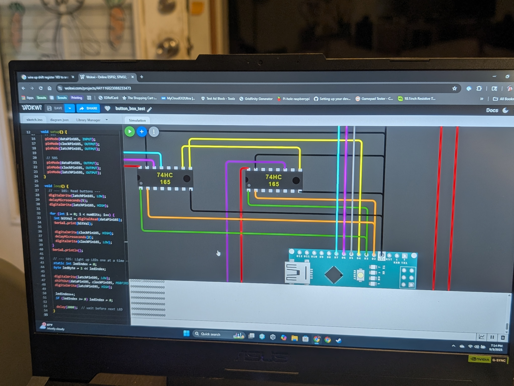
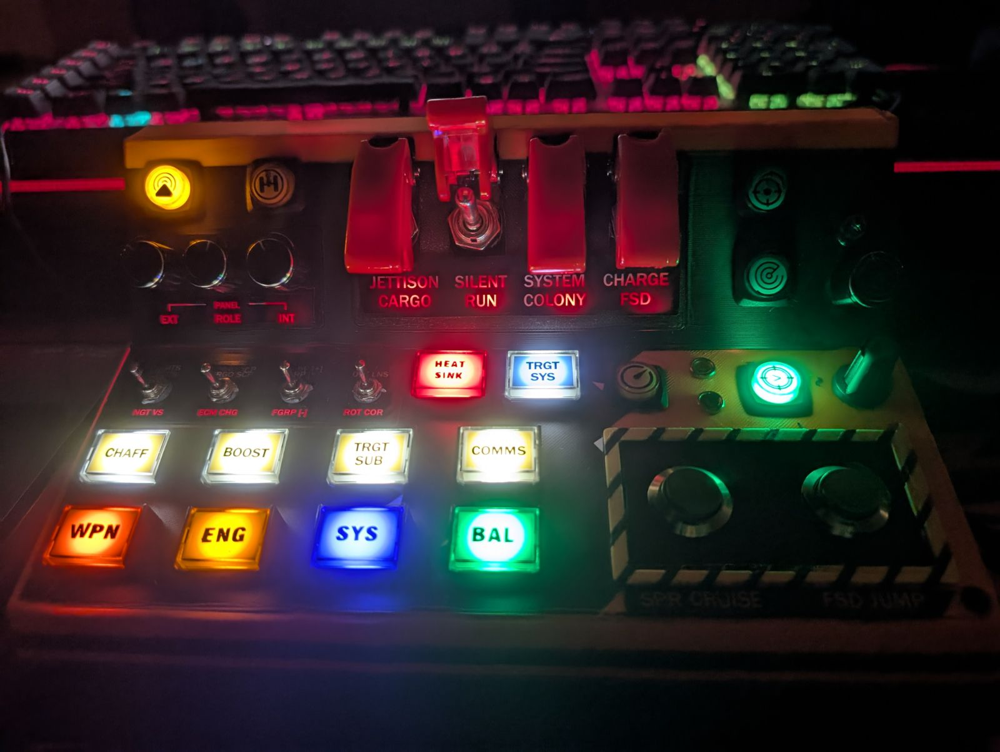

# ED Commander

**A CAD-designed, 3D-printed Elite Dangerous button box with a reactive cockpit that knows what your ship is doing.**

---
 
| Wokwi circuit simulation | Finished panel |
|---|---|
|  |  |
 
---

## Origin

I like Elite Dangerous. I do not like pressing random keyboard shortcuts in the dark while trying not to crash into a planet.

My first attempt was a generic button box kit in a plain enclosure. It worked. It was fine. It lacked soul.

The second attempt is this. A console-style panel designed in CAD, 3D-printed at an angle like a real cockpit instrument cluster, populated with illuminated arcade buttons color-coded by ship system, guarded toggle switches with missile-style flip covers, and a bidirectional Python/Arduino integration that makes the hardware aware of what's happening in the game.

The design constraint I set from the start: **the controls had to feel consequential.** Jettison Cargo shouldn't be a keyboard shortcut. It should require lifting a guard cover and flipping a switch.

---

## How It Works

This is a two-system build. The Arduino handles physical input and LED output. The Python script handles game state awareness and tells the Arduino what to light up.

### Arduino side (`sketch_sep7a.ino`)

- **5x5 button matrix** -- 24 usable inputs scanned via row/column polling
- **2x 74HC165 shift registers** -- 16 additional inputs, expanding the available switch count beyond the Arduino's native pins
- **Rotary encoder** -- CW/CCW mapped to separate joystick buttons with configurable sensitivity
- **74HC595 shift register** -- drives 8 LED outputs (steady or blink mode)
- **Boot sequence** -- all LEDs blink 3 times on power-up
- **40-button HID joystick** -- presents as a standard gamepad to Windows via the Joystick library
- **Serial command listener** -- receives `ON:n`, `OFF:n`, and `BLINK:n` commands from Python and updates LEDs in real time

### Python side (`elite_dangerous_buttonBox.py`)

- Reads Elite Dangerous' live `Status.json` file (written by the game every ~100ms)
- Parses the full **Flags** and **Flags2** bitmask -- 51 distinct game states tracked
- Maps game states to specific LEDs with configurable steady vs blink behavior
- Supports **negative flags** -- LED 3 lights when Flight Assist is OFF, not on
- Detects modifier button state via pygame joystick input
- Sends `ON:`, `OFF:`, `BLINK:` commands to Arduino over serial at 115200 baud

### The context switching system

The guarded toggle switches on the top row arm a state. The green confirmation button lights up. Pressing it commits the action.

This is a two-step commit pattern -- deliberately lifted from real cockpit design. Jettison Cargo, Silent Run, Charge FSD: you don't want those firing from a stray elbow. The guard cover + confirmation button sequence means every high-consequence action requires intentional input.

This wasn't copied from a tutorial. It's the right answer to the problem, arrived at from first principles.

---

## Hardware

| Component | Detail |
|---|---|
| Microcontroller | Arduino Leonardo (or Pro Micro -- needs native USB HID) |
| Button matrix | 5×5, 24 usable inputs |
| Shift register (input) | 2× 74HC165, 16 additional inputs |
| Shift register (output) | 74HC595, 8 LED outputs |
| Encoder | Rotary encoder, pins D0/D1 |
| Buttons | Illuminated arcade buttons, color-coded by system |
| Toggles | Guarded missile-style flip switches |
| Enclosure | CAD-designed, 3D-printed, angled console profile |

---

## Wiring

The Wokwi simulation (`wokwi.com/projects/441116023088233473`) was used to validate the 74HC165 shift register chain before committing to physical wiring. Simulating first saved significant rework.

---

## LED Mapping

| LED | Behavior | Trigger |
|---|---|---|
| 0 | Blink | FSD cooldown, mass locked, hyperdrive charging |
| 1 | Steady | Landing gear down |
| 2 | Steady | HUD in analysis mode |
| 3 | Steady | Flight assist ON (negative flag -- lights when OFF is not set) |
| 4 | Steady | Combat mode indicator |
| 5 | Blink | Low fuel, overheating, danger, interdiction, FSD jump, silent running |
| 6 | Blink | FSD charging, fuel scooping, FSD jump |
| 7 | Steady | Modifier button active |

---

## Software Dependencies

**Arduino:**
- [ArduinoJoystickLibrary](https://github.com/MHeironimus/ArduinoJoystickLibrary)
- [Encoder](https://github.com/PaulStoffregen/Encoder)

**Python:**
- `pyserial`
- `pygame`

---

## Files

| File | Description |
|---|---|
| `sketch_sep7a.ino` | Arduino firmware -- HID joystick, LED control, serial command handling |
| `elite_dangerous_buttonBox.py` | Python game state watcher -- reads ED status, drives LEDs |
| `Custom_4_2.binds` | Elite Dangerous keybind file mapping joystick buttons to ship functions |

---

## What I Learned

- Simulate before you solder. The Wokwi circuit sim caught wiring issues before a single component was touched.
- Shift registers are the right answer when you need more inputs than pins. Two 74HC165s in a chain gave 16 extra inputs cleanly.
- Bidirectional serial between Python and Arduino is straightforward but requires careful state tracking on both ends to avoid flickering.
- The enclosure design matters as much as the electronics. An angled console at 15-20 degrees is significantly more ergonomic than a flat panel.
- Building the thing you want is more satisfying than buying it. Commercial button boxes exist. None of them have a guarded Jettison Cargo switch.

---

## Status

Active and in use. Future additions: additional encoder for power management, OLED display for ship status readout, expanded LED mapping for Odyssey on-foot states.

---

*For the Pilots Federation.*
